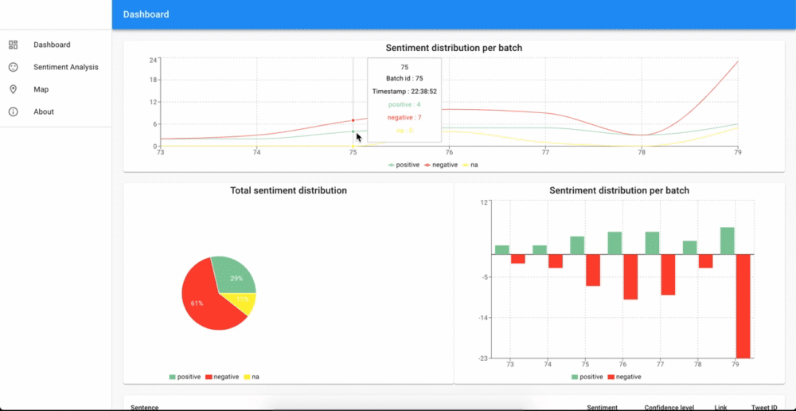
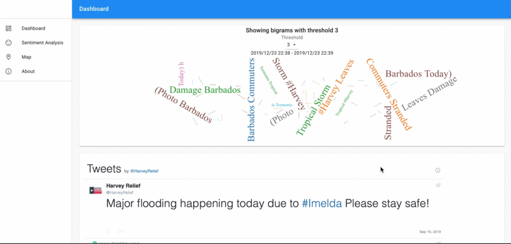

# INFO319 Project

## Dependencies

python@3.7
spark@2.4.4
Docker

# Start Kafka service

cd kafka-docker
docker-compose -f docker-compose-single-broker.yml up -d

## Start webserver

cd ../webserver_socket
docker-compose up -d

## Start webapp

`cd ../webapp`
`docker-compose up -d`

## Create a python venv for producer.py

`python3 venv -m ./.venv`
`ource ./.venv/bin/activate`

## Intall dependencies

`pip install -r packages.txt`

## Start producer

`python3 producer.py`

## Submit spark application (in new tab)
`. start_spark_fifo.sh`

## Dashboard

